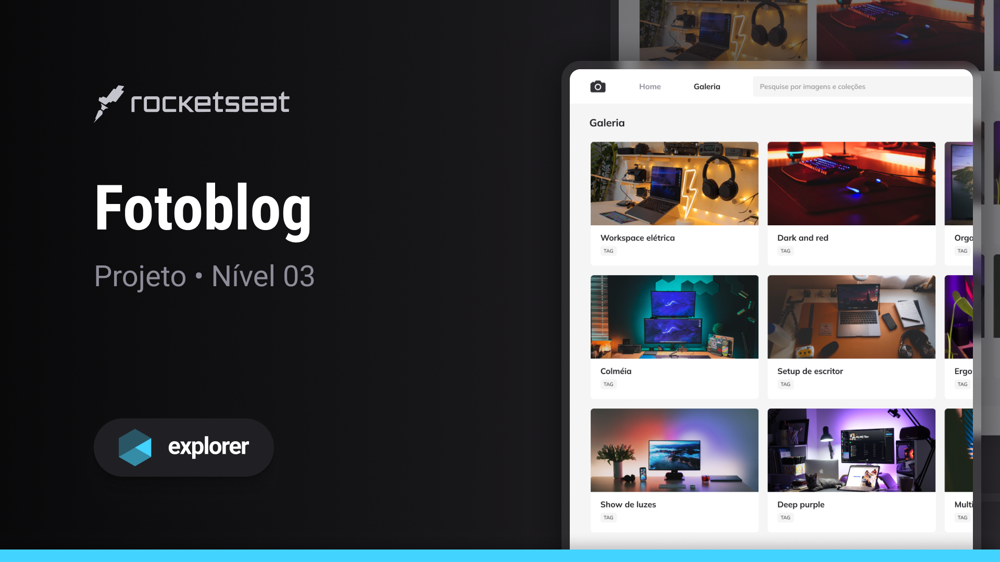

  

## 🖥️ Projeto

Esse projeto de galeria de fotos chamado Fotoblog é desenvolvido no nível 03 do Explorer.

## 🚀 Tecnologias

Esse projeto foi desenvolvido durante a Nivel 03 do Explorer da Rocketseat com as seguintes tecnologias:

- HTML
- CSS
- Figma
- Git e Github

## 🏷️ Layout

Você pode visulizar o layout do projeto através
[desse link](<https://www.figma.com/community/file/1256354844988182987>).
É necessario ter uma conta no [Figma](https://www.figma.com)

---

Feito com 💜 por <strong>Fernando Damasceno :wave: 

